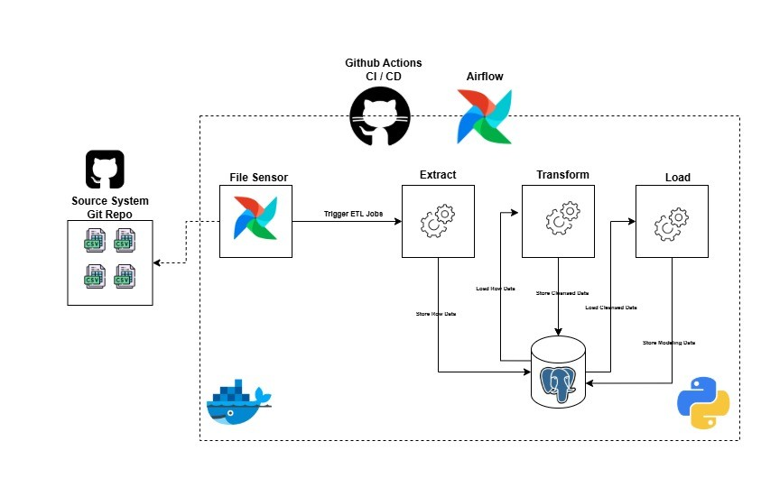

# E-Commerce ETL Data Pipeline

A comprehensive data engineering project that implements an end-to-end Extract, Transform, Load (ETL) pipeline for e-commerce data. This project leverages Apache Airflow for orchestration, PostgreSQL for data storage, and Python for data processing.

## 📋 Table of Contents
- [Overview](#overview)
- [System Architecture](#system-architecture)
- [Features](#features)
- [Project Structure](#project-structure)
- [Prerequisites](#prerequisites)
- [Installation](#installation)
- [Configuration](#configuration)
- [Usage](#usage)
- [Data Pipeline](#data-pipeline)
- [Testing](#testing)
- [Database Schema](#database-schema)
- [Contributing](#contributing)
- [License](#license)

## 🎯 Overview

This ETL pipeline processes e-commerce transaction data from GitHub repositories, performs data quality checks and transformations, and loads the processed data into a PostgreSQL data warehouse with a dimensional modeling approach (Bronze → Silver → Gold layers).

### Key Objectives
- Automated data extraction from CSV files
- Data validation and quality assurance
- Dimensional modeling for analytical queries
- Real-time pipeline orchestration with Apache Airflow
- Comprehensive testing and monitoring

## 🏗️ System Architecture



### Architecture Overview
The system follows a medallion architecture (Bronze → Silver → Gold) with the following components:

- **Data Source**: CSV files from GitHub repository
- **Orchestration**: Apache Airflow DAGs for workflow management
- **Processing**: Python-based ETL modules
- **Storage**: PostgreSQL database with dimensional modeling
- **Monitoring**: Airflow UI for pipeline visibility and logs

## ✨ Features

- ✅ **Automated File Detection**: GitHub file sensor for detecting new data files
- ✅ **Data Extraction**: CSV data ingestion with validation
- ✅ **Data Transformation**: Business logic implementation and data quality checks
- ✅ **Dimensional Modeling**: Star schema with facts and dimensions
- ✅ **Pipeline Orchestration**: Apache Airflow DAGs for scheduling and monitoring
- ✅ **Error Handling**: Robust exception management and logging
- ✅ **Testing**: Unit tests and integration tests for reliability
- ✅ **Database Connectivity**: SQLAlchemy ORM with PostgreSQL

## 📁 Project Structure

```
E-Commerce-ETL-Data-Pipeline/
├── dags/
│   └── etl_workflow.py              # Airflow DAG definition
├── src/
│   ├── __init__.py
│   ├── db_connection.py             # Database connection utilities
│   └── etl/
│       ├── __init__.py
│       ├── extract.py               # Data extraction logic
│       ├── transform.py             # Data transformation logic
│       └── load.py                  # Data loading logic
├── sql/
│   ├── DDL/
│   │   ├── bronze/                  # Raw data layer
│   │   ├── Silver/                  # Intermediate transformation layer
│   │   └── gold/                    # Final analytical layer
│   │       ├── schema.sql
│   │       ├── sales_fact.sql
│   │       ├── customer_dim.sql
│   │       ├── product_dim.sql
│   │       ├── country_dim.sql
│   │       └── date_dim.sql
├── config/                           # Configuration files
├── data/                             # Sample data files (CSV)
├── notebooks/
│   ├── data_exploration.ipynb
│   ├── extraction.ipynb
│   ├── transformation.ipynb
│   └── load.ipynb
├── tests/
│   ├── unit-tests/
│   │   ├── extraction_unit_testing.py
│   │   ├── transformation_unit_testing.py
│   │   └── loading_unit_testing.py
│   └── integeration-testing/
│       ├── extraction_integeration_testing.py
│       ├── transformation_integeration_testing.py
│       └── loading_integeration_testing.py
├── docker/
│   ├── airflow/                     # Airflow Docker setup
│   └── dev-env/                     # Development environment
├── requirements.txt
├── ruff.toml                        # Code linting configuration
└── README.md

```

## 🔧 Prerequisites

- Python 3.8+
- PostgreSQL 12+
- Docker & Docker Compose (for containerized deployment)
- GitHub account with repository access
- Git

## 📦 Installation

### 1. Clone the Repository

```bash
git clone https://github.com/SaiD-MH/E-Commerce-ETL-Data-Pipeline.git
cd E-Commerce-ETL-Data-Pipeline
```

### 2. Create Virtual Environment

```bash
python -m venv venv
source venv/bin/activate  # On Windows: venv\Scripts\activate
```

### 3. Install Dependencies

```bash
pip install -r requirements.txt
```

### 4. Database Setup

```bash
# Using Docker Compose for PostgreSQL
cd docker/dev-env/db
docker-compose up -d

# Or using local PostgreSQL installation
createdb ecommerce_warehouse
```

### 5. Initialize Database Schema

```bash
# Execute DDL scripts in order
psql -U postgres -d ecommerce_warehouse -f sql/DDL/bronze/bronze.sql
psql -U postgres -d ecommerce_warehouse -f sql/DDL/Silver/silver.sql
psql -U postgres -d ecommerce_warehouse -f sql/DDL/gold/schema.sql
psql -U postgres -d ecommerce_warehouse -f sql/DDL/gold/sales_fact.sql
psql -U postgres -d ecommerce_warehouse -f sql/DDL/gold/customer_dim.sql
psql -U postgres -d ecommerce_warehouse -f sql/DDL/gold/product_dim.sql
psql -U postgres -d ecommerce_warehouse -f sql/DDL/gold/country_dim.sql
psql -U postgres -d ecommerce_warehouse -f sql/DDL/gold/date_dim.sql
```

## ⚙️ Configuration

### Environment Variables

Create a `.env` file in the project root:

```env
# Database Configuration
DB_HOST=localhost
DB_PORT=5432
DB_NAME=ecommerce_warehouse
DB_USER=postgres
DB_PASSWORD=your_password

# GitHub Configuration
GITHUB_TOKEN=your_github_token
GITHUB_REPO=SaiD-MH/E-Commerce-ETL-Data-Pipeline

# Airflow Configuration
AIRFLOW_HOME=/path/to/airflow
AIRFLOW__CORE__DAGS_FOLDER=/path/to/dags
```

### Airflow Setup

```bash
# Initialize Airflow database
airflow db init

# Create Airflow user
airflow users create --username admin --password admin --firstname Admin --lastname User --role Admin --email admin@example.com

# Add GitHub connection in Airflow
airflow connections add github_conn --conn-type generic --conn-login your_username --conn-password your_github_token
```

## 🚀 Usage

### Running the Pipeline

#### Option 1: Using Airflow

```bash
# Start Airflow webserver
airflow webserver -p 8080

# Start Airflow scheduler (in a new terminal)
airflow scheduler

# Access Airflow UI at http://localhost:8080
```

#### Option 2: Using Docker Compose

```bash
cd docker/airflow
docker-compose up -d

# Check logs
docker-compose logs -f webserver
```

#### Option 3: Manual Execution

```bash
python -m src.etl.extract
python -m src.etl.transform
python -m src.etl.load
```

## 📊 Data Pipeline

### Pipeline Workflow

1. **GitHub File Sensor**: Monitors GitHub repository for new CSV files with format `data/data_DD-MM-YYYY.csv`

2. **Extraction**: 
   - Reads CSV file from GitHub
   - Validates required columns
   - Performs data quality checks
   - Loads raw data to Bronze layer

3. **Transformation**:
   - Data cleansing and validation
   - Business logic implementation
   - Dimension and fact table preparation
   - Loads to Silver and Gold layers

4. **Loading**:
   - Inserts dimension data (customers, products, countries, dates)
   - Loads fact table (sales)
   - Updates statistics and metadata

### Sample Data Files

Located in the `data/` directory:
- `data_13-01-2026.csv`
- `data_14-12-2025.csv`
- `data_15-12-2025.csv`

### Data Schema

**Bronze Layer (Raw Data)**
- Contains original data as-is from CSV

**Silver Layer (Cleaned Data)**
- Validated and cleaned e-commerce transactions
- Data type conversions
- Removed duplicates and nulls

**Gold Layer (Business Data)**
- Dimensional modeling (Star Schema)
- Fact Table: `sales_fact`
- Dimensions:
  - `customer_dim` - Customer information
  - `product_dim` - Product catalog
  - `country_dim` - Geographic information
  - `date_dim` - Time dimension

## 🧪 Testing

### Unit Tests

```bash
# Run unit tests for extraction
pytest tests/unit-tests/extraction_unit_testing.py -v

# Run unit tests for transformation
pytest tests/unit-tests/transformation_unit_testing.py -v

# Run unit tests for loading
pytest tests/unit-tests/loading_unit_testing.py -v

# Run all unit tests
pytest tests/unit-tests/ -v
```

### Integration Tests

```bash
# Run integration tests
pytest tests/integeration-testing/ -v
```

### Test Coverage

```bash
pytest --cov=src tests/ --cov-report=html
```

## 💾 Database Schema

### Sales Fact Table
- `sales_id` (Primary Key)
- `customer_id` (Foreign Key)
- `product_id` (Foreign Key)
- `country_id` (Foreign Key)
- `date_id` (Foreign Key)
- `quantity`
- `unit_price`
- `total_amount`

### Customer Dimension
- `customer_id` (Primary Key)
- `customer_name`
- `email`
- `created_date`

### Product Dimension
- `product_id` (Primary Key)
- `product_name`
- `description`
- `unit_price`

### Country Dimension
- `country_id` (Primary Key)
- `country_name`
- `region`

### Date Dimension
- `date_id` (Primary Key)
- `date`
- `year`
- `month`
- `day`
- `quarter`
- `day_of_week`

## 🛠️ Dependencies

Key packages used in this project:

| Package | Version | Purpose |
|---------|---------|---------|
| pandas | Latest | Data manipulation and analysis |
| psycopg2-binary | Latest | PostgreSQL adapter for Python |
| sqlalchemy | 2.0.21 | SQL toolkit and ORM |
| python-dotenv | Latest | Environment variable management |
| apache-airflow | Latest | Workflow orchestration |
| pytest | Latest | Testing framework |
| ruff | Latest | Code linting and formatting |

See [requirements.txt](requirements.txt) for the complete list.

## 📝 Code Quality

This project uses **Ruff** for code linting and formatting:

```bash
# Lint the code
ruff check .

# Format the code
ruff format .
```

Configuration is in [ruff.toml](ruff.toml).

## 📚 Notebooks

Jupyter notebooks for exploration and development:
- `notebooks/data_exploration.ipynb` - Initial data analysis
- `notebooks/extraction.ipynb` - Extraction logic development
- `notebooks/transformation.ipynb` - Transformation logic development
- `notebooks/load.ipynb` - Loading logic development

## 🔐 Security Considerations

- Never commit `.env` files or secrets to version control
- Use GitHub secrets for sensitive data in CI/CD
- Rotate database credentials regularly
- Use environment variables for all configuration
- Implement proper access controls in PostgreSQL

## 📋 Logging and Monitoring

- Airflow logs stored in `logs/` directory
- Each DAG run creates timestamped log directories
- Monitor pipeline health via Airflow UI
- Set up alerts for failed tasks

## 🐛 Troubleshooting

### Common Issues

**Issue**: Database connection refused
```bash
# Check if PostgreSQL is running
sudo systemctl status postgresql

# Or Docker
docker ps | grep postgres
```

**Issue**: Airflow connection errors
```bash
# Verify connections
airflow connections list

# Add missing connections
airflow connections add github_conn --conn-type generic --conn-password $GITHUB_TOKEN
```

**Issue**: GitHub file not found
- Verify the file naming format: `data_DD-MM-YYYY.csv`
- Check GitHub token permissions
- Ensure repository access is granted

## 🤝 Contributing

Contributions are welcome! Please follow these steps:

1. Fork the repository
2. Create a feature branch (`git checkout -b feature/AmazingFeature`)
3. Commit your changes (`git commit -m 'Add AmazingFeature'`)
4. Push to the branch (`git push origin feature/AmazingFeature`)
5. Open a Pull Request

## 📄 License

This project is licensed under the [MIT License](LICENSE) - see the LICENSE file for details.

## 📧 Contact & Support

For questions, issues, or suggestions, please:
- Open an issue on GitHub
- Create a discussion thread
- Contact the project maintainer

## 🙏 Acknowledgments

- Apache Airflow community for the orchestration framework
- PostgreSQL for the robust database engine
- The open-source community for amazing tools and libraries

---

**Last Updated**: January 13, 2026  
**Maintained By**: SaiD-MH